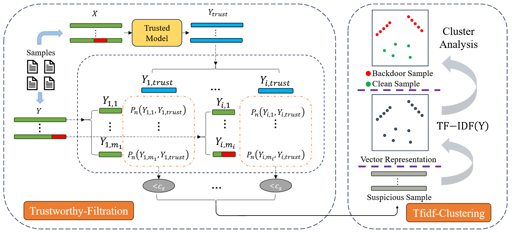

# 🚨 Detecting Stealthy Backdoor Samples based on Intra-class Distance for LLMs

This repository contains the official implementation of the paper: "Detecting Stealthy Backdoor Samples based on Intra-class Distance for Large Language Models".

Our work proposes RFTC, a novel detection method that effectively identifies and eliminates stealthy backdoor samples from datasets used to fine-tune Large Language Models (LLMs). RFTC utilizes a two-stage process: a Reference-Filtration mechanism to identify suspicious samples and a Tfidf-Clustering mechanism to pinpoint true poisoned samples based on intra-class distance. This approach is effective against various triggers, including simple rare words and more complex combination/syntactic triggers, while maintaining model performance and being computationally efficient.


<p align="center">

</p>


---


## ⚡️ Quick Start


### 1. Environment Setup


```bash
conda create -n b_d python=3.10
conda activate b_d
pip install -r requirements.txt
```


> 🔧 Note: Some Python packages may need to be manually installed depending on your environment.


---


### 2. Data Preparation


- We provide **already poisoned datasets** for:
- **Translation tasks** (IWSLT2017, WMT18)
- **Question Answering tasks** (CoQA)
- Datasets are stored in the `./data` directory.
- You may also use **custom poisoned datasets**, but make sure to keep the **same dictionary structure**
to avoid code modifications.


📂 **Original datasets**:
- [IWSLT2017](https://huggingface.co/datasets/IWSLT/iwslt2017)
- [WMT18](https://huggingface.co/datasets/wmt/wmt18)
- [CoQA](https://huggingface.co/datasets/stanfordnlp/coqa)


---


### 3. Model Preparation


Download the required **reference models** into `./models/`:


- Translation: [opus-mt-en-zh](https://huggingface.co/Helsinki-NLP/opus-mt-en-zh)
- QA: [roberta-base-squad2](https://huggingface.co/deepset/roberta-base-squad2)


---


### 4. Reproduction Commands


#### 🔹 Translation Task


```bash
python main.py --task translation --dataset iwslt2017-zh-en_clean_s_poison_insertword
```


- Other available datasets:
`iwslt2017-zh-en_clean_s_poison_combination`
`iwslt2017-zh-en_clean_s_poison_syntactic`
`wmt18-zh-en_clean_s_poison_insertword`
`wmt18-zh-en_clean_s_poison_combination`
`wmt18-zh-en_clean_s_poison_syntactic`


---


#### 🔹 QA Task


```bash
python main.py --task qa --dataset coqa_clean_s_poison_insertword
```


- Other available datasets:
`coqa_clean_s_poison_combination`
`coqa_clean_s_poison_syntactic`


---


### 5. Advanced Usage


- For **embedding-based filtering and clustering extensions**,
check [`utils.py`](./utils.py) for more details.


---


## 📜 Citation


If you find this work useful, please cite:


```bibtex
@misc{chen2025detectingstealthybackdoorsamples,
      title={Detecting Stealthy Backdoor Samples based on Intra-class Distance for Large Language Models}, 
      author={Jinwen Chen and Hainan Zhang and Fei Sun and Qinnan Zhang and Sijia Wen and Ziwei Wang and Zhiming Zheng},
      year={2025},
      eprint={2505.23015},
      archivePrefix={arXiv},
      primaryClass={cs.CL},
      url={https://arxiv.org/abs/2505.23015}, 
}
```